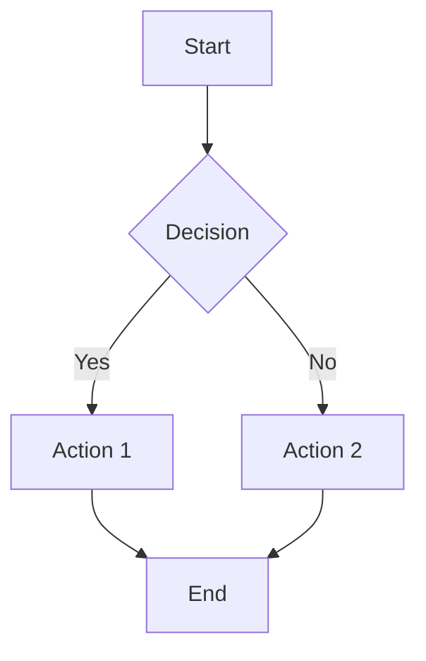
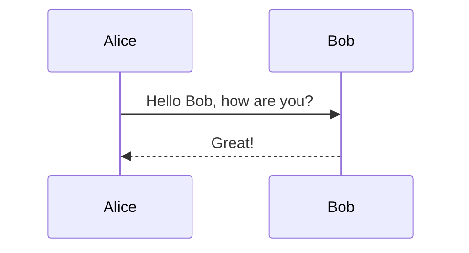
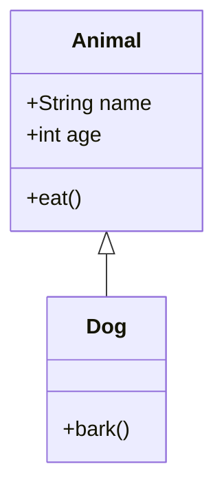

# Mermalaid - Free Mermaid Diagram Editor | Source-available

**Mermalaid** helps you create Mermaid diagrams faster, without paywalls or sign-ups. Build flowcharts, sequence diagrams, class diagrams, and more with live preview and visual editing. The source code is available under CC BY-NC-SA 4.0 (non-commercial).

[](https://creativecommons.org/licenses/by-nc-sa/4.0/)
[](LICENSE)
[]()

## 🎯 Why Mermalaid

If you need a **free Mermaid editor** without limits, subscriptions, or account walls, Mermalaid is built for you. It stays free and source-available, with no document caps and no premium lock-in.

### Key Differentiators

- ✅ **100% Free** - No usage limits, no hidden fees, no premium upsell
- ✅ **Source-available Codebase** - Full source under CC BY-NC-SA 4.0 (non-commercial)
- ✅ **No Sign-Up Required** - Open the editor and start diagramming instantly
- ✅ **Unlimited Diagrams** - Create as many Mermaid charts as you need
- ✅ **Professional Features** - Live preview, visual editor, syntax checks, flexible export, and private share links
- ✅ **Privacy-First** - Your diagrams stay local; no cloud sync required
- ✅ **Web & Desktop** - Use it in your browser or as a native macOS or Windows app

## 🚀 Quick Start - Create Your First Mermaid Diagram

### Use Online (Web Version)

Visit [Mermalaid](https://mermalaid.com) to start creating Mermaid diagrams instantly in your browser—no installation needed.

### Download Desktop App (macOS and Windows)

1. Download the latest release from [GitHub Releases](https://github.com/highvoltag3/mermalaid/releases)
2. Install the `.dmg` file on macOS or the x64 `.exe` setup file on Windows
3. Start creating unlimited free Mermaid diagrams
4. 🏴‍☠️ IMPORTANT: Follow this step: [Installing the Desktop App](#installing-the-desktop-app).


## ✨ Features - Professional Editor, Zero Cost

Mermalaid includes the features teams usually pay for, while staying free to use:

### Editor Features

- **Monaco Editor** - Write Mermaid with robust syntax highlighting
- **Live Preview** - See updates in real time with smooth debounced rendering (500ms)
- **Resizable Panels** - Drag the divider to set the editor width; your layout is saved across sessions
- **Visual Editor** - Drag and connect flowchart nodes, then sync changes back to code
- **Real-time Syntax Validation** - Catch errors early and fix faster
- **Auto-save** - Keep work in local storage so progress is not lost
- **Dark/Light Mode** - Work comfortably in your preferred theme
- **beautiful-mermaid Themes** - Style both diagrams and app UI with curated themes
- **Toast Notifications** - Get clear feedback for save, export, and error actions
- **AI Assistant** - Chat about the diagram you are looking at with your own API key — **Anthropic** (sent straight from the page to Anthropic) or **IBM Consulting Advantage** (routed through this site's own `/api/ica` function, because the ICA API refuses browser calls; pick the namespace and model in Settings). Keys are stored in your browser only. The assistant sees the current diagram and any render error, answers questions about it, and proposes changes as a card you review and apply — nothing is written to your document until you press Apply
- **AI Syntax Fix** - Fix broken Mermaid syntax quickly using your own OpenAI API key (stored locally on your machine)

### File Management

- **Multiple Diagram Tabs** - Keep several `.mmd` documents open at once and switch between them; unsaved tabs are marked, and the whole set of tabs is restored on your next visit
- **Each Tab Is a Workspace** - A new tab opens empty and asks what it should hold: start a new diagram, open an existing `.mmd` file, or pick one from your recent files (desktop). Opening a file fills the empty tab you are looking at instead of adding another one
- **Unsaved-Change Guards** - Closing a tab with unsaved edits asks first, and on the desktop app closing the window offers to save every unsaved diagram before it goes
- **Open Files** - Import `.mmd`, `.txt`, or `.md` files (pick or drop several at once — each opens in its own tab)
- **Live Reload (desktop)** - Edit the open file in any external editor; Mermalaid re-renders on save
- **Save Diagrams** - Export Mermaid diagrams to local files
- **Export Options**:
  - **SVG Export** - Vector graphics for presentations and documents
  - **PNG Export** - The full diagram at its own size (never cropped to the window, and without the preview's zoom controls), at a resolution you pick: Standard 1× through Ultra 4× for print-quality output. The dialog shows the exact pixel size before you export, and remembers your choice
  - **PDF Export** - One diagram per page, either for the tab you are on or for every open tab combined into a single document. Each page is the size of its own diagram, so nothing is cropped or letterboxed, and the resolution choice doubles as the print resolution (Standard 1× = 96 dpi through Ultra 4× = 384 dpi)
- **ASCII Export** - Unicode box-drawing for terminals (flowcharts, state, sequence, class, ER diagrams)
- **Copy to Clipboard** - Copy Markdown-ready Mermaid blocks for docs and GitHub
- **Private URL Share** - **Copy private link** stores encrypted diagram data in the URL fragment only (no upload, no server-side storage)

### Mermaid Diagram Types Supported

Create diagrams across the full Mermaid ecosystem:

- **Flowcharts** (`graph`, `flowchart`)
- **Sequence Diagrams** (`sequenceDiagram`)
- **Class Diagrams** (`classDiagram`, `classDiagram-v2`)
- **State Diagrams** (`stateDiagram`, `stateDiagram-v2`)
- **Entity Relationship Diagrams** (`erDiagram`)
- **User Journey** (`journey`)
- **Gantt Charts** (`gantt`)
- **Pie Charts** (`pie`)
- **Git Graphs** (`gitGraph`)
- **And More** - Broad Mermaid.js coverage

### Cross-Platform Support

- **Web Application** - Works in any modern browser
- **Native Desktop App** - Lightweight application for macOS and Windows
- **Vercel Hosting** - Static Vite deployment with preview and production URLs

## 💻 Technical Excellence

### Built with Modern Technologies

- **Tauri** - Lightweight, secure, native desktop framework (~10MB vs ~100MB+ Electron apps)
- **React** + **TypeScript** - Modern, type-safe UI development
- **Monaco Editor** - The same editor that powers VS Code
- **beautiful-mermaid** - Beautiful, themed Mermaid diagram rendering with customizable themes
- **@xyflow/react** - Visual editor for drag-and-drop flowchart editing

### Why Tauri?

Mermalaid uses Tauri instead of Electron for a superior experience:

- 🚀 **Much smaller app size** (~10MB vs ~100MB+ for Electron)
- ⚡ **Better performance** using system webview instead of bundled Chromium
- 🔒 **Enhanced security** with Rust backend
- 💰 **Lower memory usage** - Runs efficiently on any machine
- 🎯 **Better native integration** - Feels like a real native app

## 📚 Use Cases - When to Use Mermalaid

Mermalaid works well for:

- **Software Developers** - Document architecture, workflows, and system design
- **Technical Writers** - Add clear diagrams to docs and tutorials
- **Project Managers** - Visualize processes and delivery plans
- **Students** - Create diagrams for assignments and presentations
- **DevOps Engineers** - Map infrastructure and deployment pipelines
- **Anyone** - Build Mermaid diagrams without limits or subscriptions

## 🎨 Example Mermaid Diagrams

Try these examples in Mermalaid:

### Flowchart Example



### Sequence Diagram Example



### Class Diagram Example



## 🔧 Development & Installation

### Prerequisites

- Node.js 18+
- Rust (Tauri will install automatically if not present)
- macOS (to build the macOS app) or Windows 10/11 with the Microsoft C++ Build Tools (to build the Windows installer)

### Running in Development

```bash
# Install dependencies
npm install

# Run Tauri in development mode (desktop app)
npm run tauri:dev

# Or run web version only
npm run dev
```

This will:
1. Start the Vite dev server on `http://localhost:5173`
2. Launch Tauri with the development server (if using desktop)
3. Hot reload your React app

### Building for Production

```bash
# Build web assets
npm run build

# Build the desktop app for the current platform
npm run tauri:build
```

The built app will be in `src-tauri/target/release/bundle/`:
- macOS: `.app` bundle and `.dmg` installer
- Windows: x64 NSIS `.exe` installer

### Installing the Desktop App

**Important:** The app is currently unsigned (not code-signed), so macOS warns you the first time you open the app and Windows warns you when you run the installer.

#### macOS

macOS may report the app as "damaged" when you first open it.

**Recommended Installation Method:**
```bash
# 1. Copy the app from the DMG to Applications
cp -R /Volumes/Mermalaid_*/Mermalaid.app /Applications/

# 2. Remove quarantine attribute
xattr -cr /Applications/Mermalaid.app

# 3. Open the app
open /Applications/Mermalaid.app
```

**Alternative: System Settings**
1. Open **System Settings** → **Privacy & Security**
2. Scroll down to see the blocked app message
3. Click **"Open Anyway"** next to the Mermalaid warning
4. Click **"Open"** in the confirmation dialog

#### Windows

The installer is unsigned, so SmartScreen shows "Windows protected your PC" when you run the `.exe`. Click **More info**, then **Run anyway** to continue with the installation.

## ⌨️ Keyboard Shortcuts

- `⌘N` (Mac) / `Ctrl+N` (Windows/Linux): New diagram (opens a new tab)
- `⌘O` / `Ctrl+O`: Open file (in its own tab)
- `⌘S` / `Ctrl+S`: Save file
- `⌘T` / `Ctrl+T`: New tab
- `⌘W` / `Ctrl+W`: Close tab (`⇧⌘W` closes the window)
- `⌃Tab` / `⌃⇧Tab`: Next / previous tab
- `⌘1`…`⌘9`: Jump to tab (`⌘9` is the last tab)

Browsers reserve some of these for their own tabs, so `⌘T`, `⌘W`, `⌃Tab` and `⌘1`…`⌘9` are
desktop-app shortcuts; on the web use the tab bar, or `⌘⌥←` / `⌘⌥→` to step between tabs.

## 🤝 Contributing

Mermalaid is source-available and welcomes contributions! See [CONTRIBUTING.md](CONTRIBUTING.md) for guidelines.

Areas where contributions are especially welcome:
- Additional Mermaid diagram types
- Export formats
- Platform support (Linux)
- Performance improvements
- Documentation and examples

## 📖 Documentation

- [Contributing Guide](CONTRIBUTING.md) - How to contribute to Mermalaid
- [Project Structure](PROJECT_STRUCTURE.md) - Codebase organization and file structure
- [Deployment Guide](docs/DEPLOYMENT.md) - Deploy the Mermalaid web version on Vercel
- [AI Agent Integration](docs/AGENT_INTEGRATION.md) - Let Claude, Cursor & other MCP agents edit diagrams live

## 🐛 Troubleshooting

**Tauri won't start:**
- Make sure Rust is installed: `rustc --version`
- Tauri will prompt to install Rust if missing
- Check that port 5173 is available for dev server

**Build fails:**
- Ensure you've run `npm run build` first
- Check that `dist/` directory exists with built files
- On macOS, you may need to allow the app in Security & Privacy settings

**App size concerns:**
- Tauri apps are much smaller than Electron (~10MB vs ~100MB+)
- First build may take longer as Rust compiles dependencies

## 📄 License

This work is licensed under a [Creative Commons Attribution-NonCommercial-ShareAlike 4.0 International License](http://creativecommons.org/licenses/by-nc-sa/4.0/).

**CC BY-NC-SA 4.0** - Free to use, modify, and share for non-commercial use.

Because this license includes a non-commercial clause, Mermalaid is source-available rather than OSI open source.

## 🌟 Why Choose Mermalaid Over Other Mermaid Editors?

| Feature | Mermalaid | Other Tools |
|---------|-----------|-------------|
| **Cost** | ✅ 100% Free | ❌ Free tier with limits, paid for unlimited |
| **Source-available** | ✅ Yes (CC BY-NC-SA 4.0, non-commercial) | ❌ Usually closed source |
| **Document Limits** | ✅ Unlimited | ❌ Often 3-5 documents max |
| **Multiple Open Documents** | ✅ Tabbed, session restored | ✅/❌ Varies |
| **Sign-Up Required** | ✅ No | ❌ Usually required |
| **Privacy** | ✅ Local storage only | ❌ Cloud sync required |
| **Export Options** | ✅ SVG, PNG, PDF, ASCII | ✅/❌ Varies |
| **AI Assistant** | ✅ Your own Anthropic or IBM ICA key, changes need approval | ✅/❌ Varies |
| **Syntax Validation** | ✅ Real-time | ✅/❌ Varies |
| **Desktop App** | ✅ Native macOS and Windows | ❌ Often web-only |
| **Visual Editor** | ✅ Yes (flowcharts) | ❌ Usually code-only |

---

**⭐ Star this repo** if you find Mermalaid useful for creating free, unlimited Mermaid diagrams!

**🔗 Share Mermalaid** with others who need a completely free, source-available Mermaid editor.

**💬 Have questions?** Open an issue or check our documentation.

---

*Mermalaid - Free Mermaid Diagram Editor. Source-available. 100% free. Forever.*
